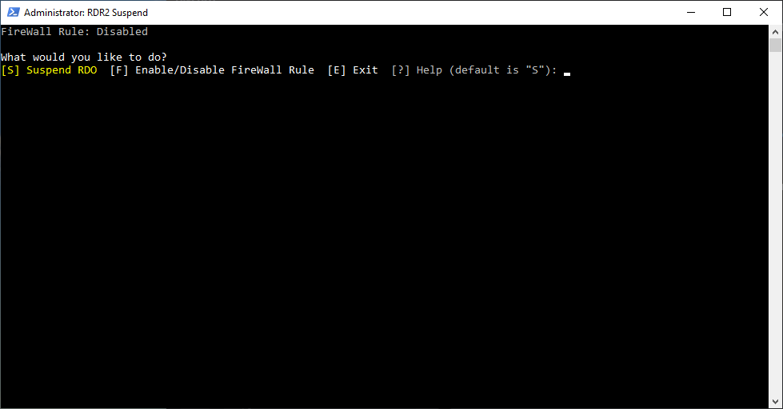

# Suspend Rockstar
Quick script to pause and restart Grand Theft Auto V or Red Dead Redemption 2 process on PC. Specifically used when playing Grand Theft Auto Online or Red Dead Online as it will put you into a temporary solo lobby.

Additionally it will create a Firewall Rule to block specific ports to extend the Solo Lobby indefinitely. The Firewall Rule can be enabled/disabled as an optional extra.

This Project is similar to the [Red Dead Online Solo Lobby Batch Script](https://github.com/PrettyPrintSpaghettiCode/RDO_Solo_Lobby) Project. One uses Batch files and the other PowerShell. There is nothing to install with this script as it will dynamically pull the source code from GitHub.

If you are concern by the trust and permissions required, please check the script first and confirm it is not performing any unauthorised actions.

## Installation
### PS Tools
A once off installation of PS Tools is required.
1. Download PSTools from [PsTools](https://docs.microsoft.com/en-us/sysinternals/downloads/pstools)
2. Unzip into a folder of your choice.
3. Add the PSTools folder into the Windows Environmental Path (Instructions [here](https://www.architectryan.com/2018/03/17/add-to-the-path-on-windows-10/)).

### Suspend Rockstar Shortcut
1. Create a new **Desktop Shortcut**.
2. Add either of the following commands below to the *Type the location of the item* box. Use **pwsh.exe** if installed.
3. Call the Shortcut **Suspend Rockstar** and click *Finish*.
4. Set the shortcut to permanently **Run as Administrator** by right-clicking the **Shortcut**, selecting *Properties*, click on *Advanced*, check the *Run as Administrator* box.

#### PowerShell 5.1 (PowerShell.exe)
`powershell.exe -ExecutionPolicy Bypass -Command "icm -Command ([ScriptBlock]::Create((iwr -Uri 'https://raw.githubusercontent.com/nomadtales/SuspendRockstar/master/Suspend-Rockstar.ps1' -UseBasicParsing).Content))"`

#### PowerShell 7 (PwSh.exe)
`pwsh.exe -ExecutionPolicy Bypass -Command "icm -Command ([ScriptBlock]::Create((iwr -Uri 'https://raw.githubusercontent.com/nomadtales/SuspendRockstar/master/Suspend-Rockstar.ps1' -UseBasicParsing).Content))"` 

## Usage
- When starting the script it will try and create the FireWall Rule the first time. Enter on *Y* to Confirm creation.
- Once started either type *S* to Suspend GTAO or RDR2 for 10 seconds or *F* to enable the FireWall Rule.
- Only Enable the FireWall Rule once you are in a Session, otherwise you will not be able to connect to a game.

